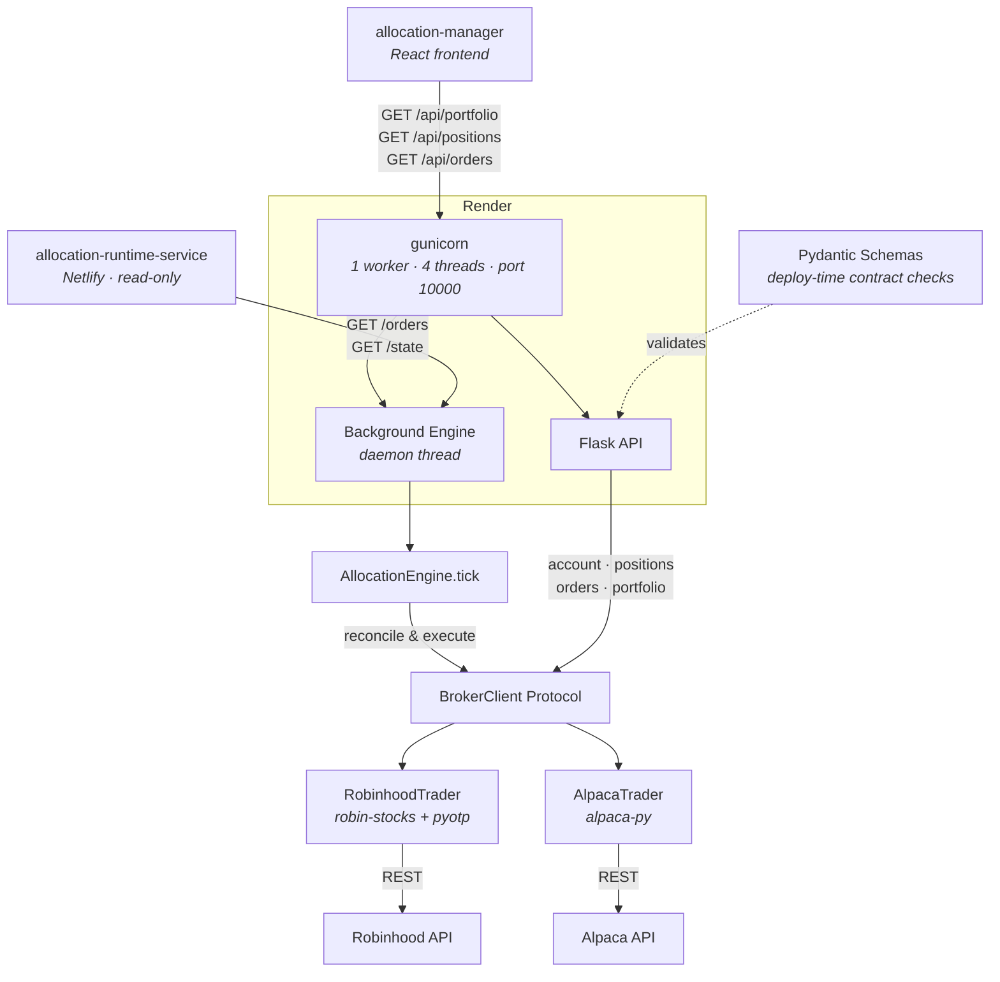
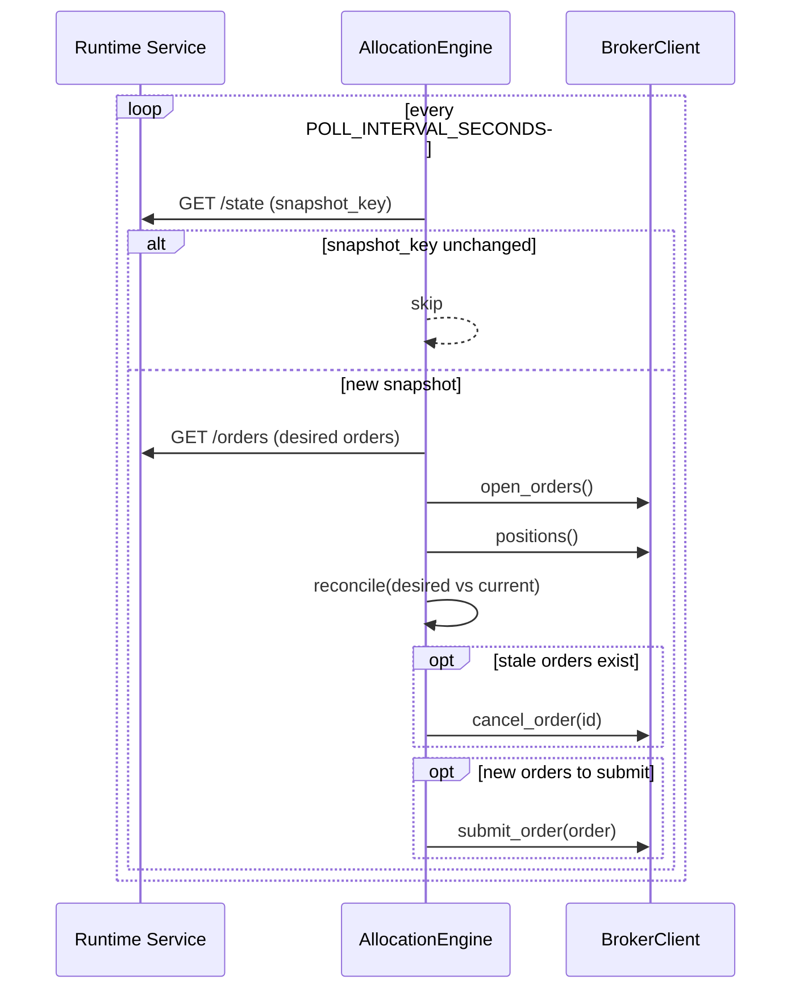
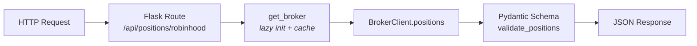
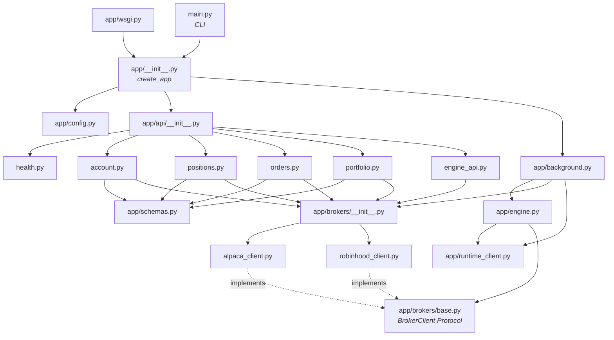

# Allocation Engine 2.0

Flask API service for portfolio monitoring and trade execution across **Robinhood** and **Alpaca** brokers. Deploys on Render via gunicorn.

## How it works

1. **Read** — Fetches desired orders from the runtime service (`/api/orders`)
2. **Reconcile** — Diffs desired state against broker open orders & positions
3. **Execute** — Cancels stale orders and submits new ones

The background engine loop runs alongside the Flask API in a daemon thread.

## Setup

```bash
pip install -r requirements.txt
cp .env.example .env
# Fill in broker credentials
```

## Usage

### Production (Render / gunicorn)

```bash
gunicorn app.wsgi:application
```

### Local development

```bash
# Flask dev server
python main.py serve

# CLI: check account status
python main.py --broker robinhood status
python main.py --broker alpaca status

# CLI: single reconciliation tick
python main.py --broker alpaca once

# CLI: continuous loop
python main.py --broker alpaca run
```

## API Endpoints

| Method | Path | Description |
|--------|------|-------------|
| GET | `/api/health` | Service status + config |
| GET | `/api/account[/<broker>]` | Account summary (equity, cash, buying power) |
| GET | `/api/positions[/<broker>]` | Open positions with P&L |
| GET | `/api/orders[/<broker>]` | Open orders |
| GET | `/api/portfolio[/<broker>]` | Account + positions combined |
| GET | `/api/engine/status` | Background engine loop status |
| POST | `/api/engine/tick` | Manually trigger reconciliation |

Broker defaults to `DEFAULT_BROKER` env var. Append `/alpaca` or `/robinhood` to target a specific broker.

## Environment Variables

| Variable | Description | Default |
|----------|-------------|---------|
| `ENABLED_BROKERS` | Comma-separated broker list | `robinhood` |
| `DEFAULT_BROKER` | Default broker for API | `robinhood` |
| `RH_USER` | Robinhood email | required for RH |
| `RH_PASS` | Robinhood password | required for RH |
| `RH_TOTP_SECRET` | Base32 TOTP secret for automated MFA | required for RH |
| `ALPACA_API_KEY` | Alpaca API key | required for Alpaca |
| `ALPACA_SECRET_KEY` | Alpaca secret key | required for Alpaca |
| `ALPACA_PAPER` | Use Alpaca paper trading | `true` |
| `RUNTIME_SERVICE_URL` | Runtime service base URL | `https://route-runtime-service.netlify.app/api` |
| `POLL_INTERVAL_SECONDS` | Engine loop interval | `30` |
| `DRY_RUN` | Log orders without submitting | `true` |
| `ENGINE_ENABLED` | Run background engine loop | `true` |
| `ENGINE_BROKER` | Broker for engine reconciliation | `alpaca` |
| `PORT` | Server port | `10000` |

## Service boundaries

This repo holds two independently-operated services plus a local tool:

- **core-logic** — the allocation engine (`app/`, `main.py`): API + engine loop
  on Render.
- **auth-service/** — standalone Robinhood auth/session service on its own GCP
  VM (see `auth-service/README.md`).
- **robinhood-mcp/** — local MCP server exposing our Robinhood logic as tools
  (see `robinhood-mcp/README.md`).

**Rule: work on one service touches only that service.** Core-logic work stays
in core-logic; auth-service work stays in `auth-service/`. At runtime the two
may only interact through **reads** (core-logic calling the auth-service's
read endpoints — `/auth/status`, `/token`, `GET /orders/trailing_stop`);
neither modifies the other's code, config, or deployment.

**Robinhood authentication runs only in the auth-service box.** Nothing else
runs a Robinhood login/authenticate flow — consumers take a vended bearer from
the box's `GET /token` and re-vend once on `401`. The box owns login, refresh,
and device identity.

## Architecture

### System overview



### Reconciliation loop



### Request flow



### Module dependencies


